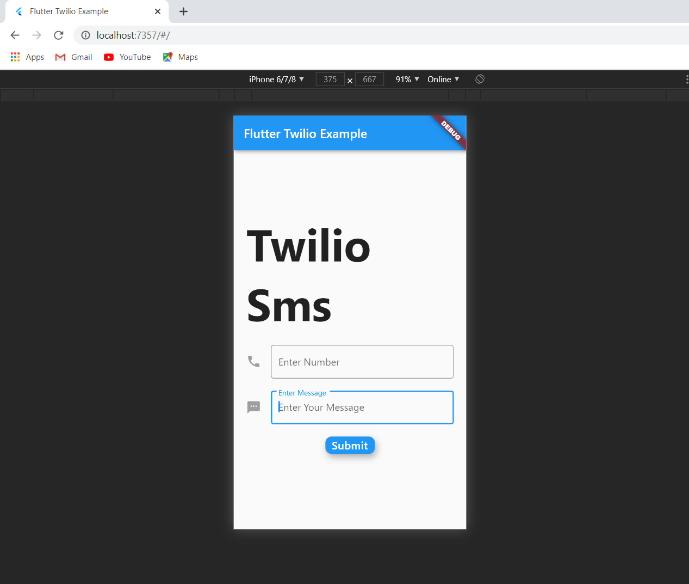

# Flutter Twilio Sms Example Easy



- Package used [twilio_flutter: ^0.0.5](https://pub.dev/packages/twilio_flutter)

---

## Step 1
- Create a new object
```dart
TwilioFlutter twilioFlutter;
```

## Step 2
- From InitState, Initialize with values
```dart
  @override
  void initState() {
    // TODO: implement initState
    twilioFlutter = TwilioFlutter(
        accountSid: '***', // replace *** with Account SID
        authToken: 'xxx', // replace xxx with Auth Token
        twilioNumber: '+....' // replace .... with Twilio Number
        );
    super.initState();
  }
```

## Step 3
- Send Sms
```dart
  void sendSms() async {
    twilioFlutter.sendSMS(
        toNumber: '+91', messageBody: 'hello world');
    //Use sendSMS with the recipient number and message body.
  }
```

## Step 4
- Call the sendSms() method from any onPressed event.

## For Live Testing
- [Flutter Twilio Demo Live](http://flutter-twilio-demo.surge.sh/#/)
- Account Sid :- Enter Your Twilio Account SID.
- Auth Token :- Enter Your Twilio AUTH TOKEN.
- Twilio Number :- Enter Your Twilio Phone Number.
- Number :- Enter the Receiver Phone Number to whom you want to send the message. **(Enable appropriate Messaging Geographic Permissions from your twilio dashboard)**
- Message :- Enter the message you want to send.